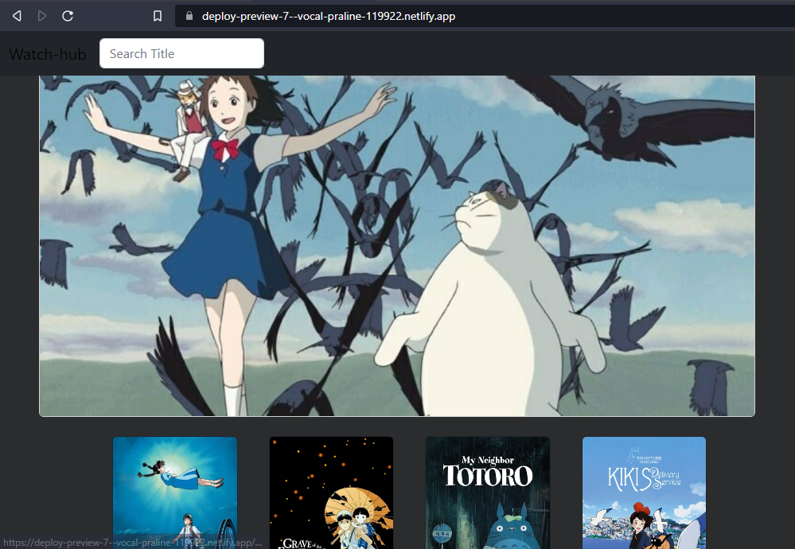

#### Watch-hub
> Description of the project: 
This is a web app that displays a collection of anime from [https://ghibliapi.herokuapp.com/](this API). You enter a search text that filters the collection to show your desired result.
This project was bootstrapped with [Create React App](https://github.com/facebook/create-react-app), using the [Redux](https://redux.js.org/) and [Redux Toolkit](https://redux-toolkit.js.org/) template. 


## Built With

- Major languages: HTML | CSS | JavaScript 
- Library/Framework: Reactjs | Redux | Jest 

## Live Demo
[Live Demo Link](https://deploy-preview-7--vocal-praline-119922.netlify.app/)

## Project Video
[Project Video Link](https://drive.google.com/file/d/1CVfI0N-Z8TxnqxhFu4gL2r2a1JurjTkP/view?usp=sharing)


## Preview


## Getting started

#### Clone this repository

```bash
$ git clone https://github.com/AckonSamuel/watch-hub.git
```

#### cd into directory
```
$ cd <relative-path>/watch-hub/
```

#### install dependencies
``` run 
$ npm i
```
#### run project
```
$ npm start
```

## Author

👤 **Ackon Samuel**
- GitHub: [@AckonSamuel](https://github.com/AckonSamuel/)
- Twitter: [@AckonSamuel2](https://twitter.com/AckonSamuel2)
- LinkedIn: [LinkedIn](https://www.linkedin.com/in/samuel-yaw-ackon/)

👤
## 🤝 Contributing

Contributions, issues, and feature requests are welcome!

Feel free to check the [issues page](../../issues/).

## Show your support

Give a ⭐️ if you like this project!
